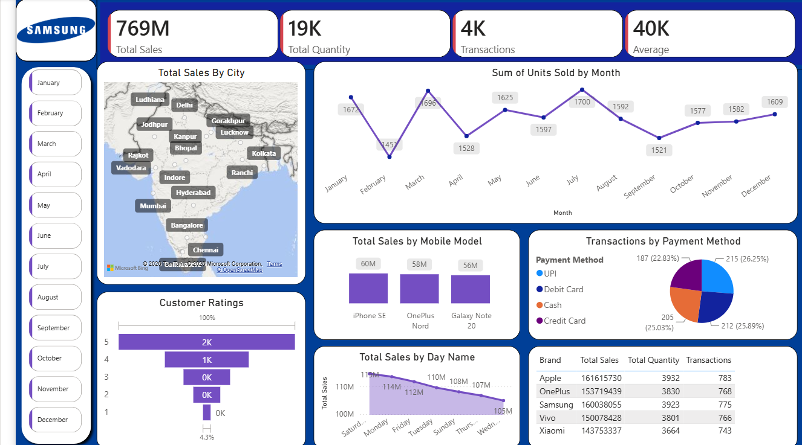

# 📱 Mobile Sales Analysis Dashboard

An interactive **Power BI** dashboard that analyses mobile phone sales across Indian cities, brands, models, payment methods and time periods, to help understand what sells, where and when.

## 📊 Key Metrics

| Metric | Value |
|---|---|
| Total Sales | 769M |
| Total Quantity | 19K units |
| Transactions | ~4K |
| Average (sale value per unit) | ~40K |

## ✨ Dashboard Features

- **KPI cards** for total sales, total quantity, transactions and average sale value
- **Total Sales by City**: map view covering cities such as Delhi, Mumbai, Bangalore, Chennai, Hyderabad, Kolkata, Lucknow, Kanpur and more
- **Sum of Units Sold by Month**: line chart showing monthly sales trend
- **Total Sales by Mobile Model**: iPhone SE, OnePlus Nord and Galaxy Note 20
- **Transactions by Payment Method**: UPI, Debit Card, Credit Card and Cash
- **Customer Ratings**: funnel chart of rating distribution (1 to 5 stars)
- **Total Sales by Day Name**: which weekdays perform best
- **Brand Summary Table**: total sales, quantity and transactions for Apple, OnePlus, Samsung, Vivo and Xiaomi
- **Month slicers** (January to December) to filter the whole dashboard

## 🔍 Key Insights

- **Apple** leads brand-wise sales (~161.6M), followed closely by **Samsung** (~160.0M) and **OnePlus** (~153.7M). **Xiaomi** is lowest (~143.8M).
- **iPhone SE** is the top-selling model by sales (60M), ahead of OnePlus Nord (58M) and Galaxy Note 20 (56M).
- **UPI** is the most used payment method (26.25%), though all four methods are fairly evenly split (22.8% to 26.3%).
- **Saturday** records the highest sales (~115M) and **Wednesday** the lowest (~105M).
- Units sold **peak in July (1,700)** and are **lowest in February (1,451)**.
- **5-star ratings** make up the largest share of customer feedback.

## 🛠️ Tools Used

- Microsoft Power BI Desktop (interactive visuals, slicers, map and KPI cards)

## 🚀 How to Use

1. Download the `.pbix` file from this repository.
2. Open it in **Power BI Desktop**.
3. Use the month slicers on the left to filter the dashboard and click on any chart element to cross-filter the other visuals.

## 👤 Author

**Sanidhya Srivastava**
B.Tech CSE (AI & DS)

- LinkedIn: [sanidhya-srivastava-756a22324](https://www.linkedin.com/in/sanidhya-srivastava-756a22324)
- GitHub: [Sanidhya188](https://github.com/Sanidhya188)
- Email: sanidhya464@gmail.com
